# Veiviser: Finne riktig region for Azure VM-er i Azure for Students

## Innledning

Når du oppretter en Azure for Students-subscription, følger det med en policy kalt **"Allowed resource deployment regions"**. Denne policyen begrenser hvilke Azure-regioner du kan deploye ressurser i - typisk 5 regioner. Men her kommer en viktig detalj: **ikke alle tillatte regioner støtter alle ressurstyper**, spesielt ikke virtuelle maskiner (VM-er).

Denne guiden hjelper deg med å finne ut hvilke regioner som faktisk fungerer for å opprette VM-er med tilhørende ressurser.

---

## Steg 1: Sjekk hvilke regioner som er tillatt av policyen

### Metode A: Via Azure Portal

1. Logg inn på [Azure Portal](https://portal.azure.com)
2. Søk etter **"Policy"** i søkefeltet øverst
   1. 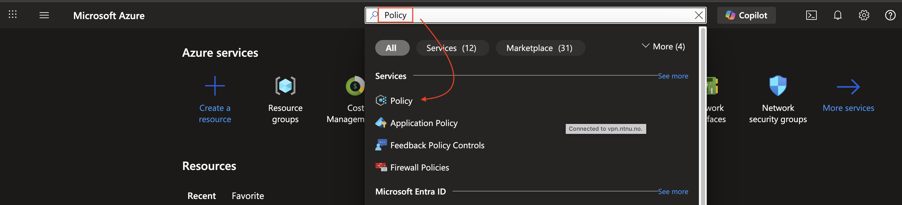
3. Velg **"Authoring"** i venstremenyen, og deretter **"Assignment"**
4. Finn **"Allowed resource deployment regions"**
5. Klikk på policyen for å se detaljer
   1. 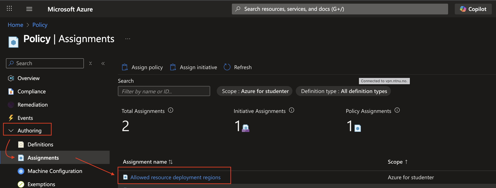
6. Under **"Parameters"** eller **"Assignments"** kan du se hvilke regioner som er tillatt. Om du ikke ser hele listen kan du kopiere med deg alle regionene og lime det inn i et dokument for senere oversikt:
   1. 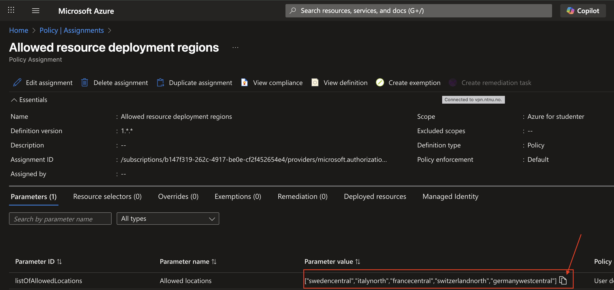

### Metode B: Under ressursoppretting

1. Forsøk å opprette en ressurs (f.eks. Virtual Machine)
2. Skriv Virtual Machine i toppen og velg deretter Virtual Machine fra listen:
   1. 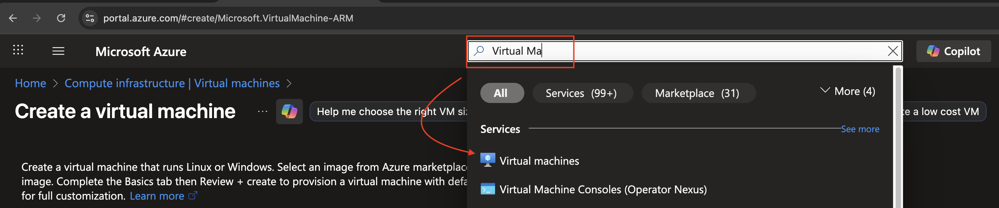
3. Velg deretter å opprette en ny VM:
   1. 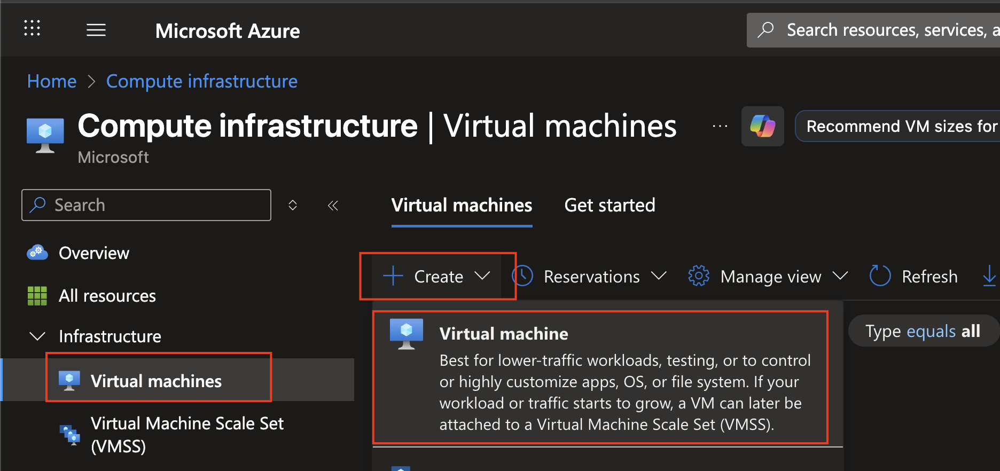
4. Her velger du tilgjengelig subscription (Azure for students) og følgende valg (husk å prøv en region fra din liste, prøv først fra de øverste som står som annbefalt):
   1. 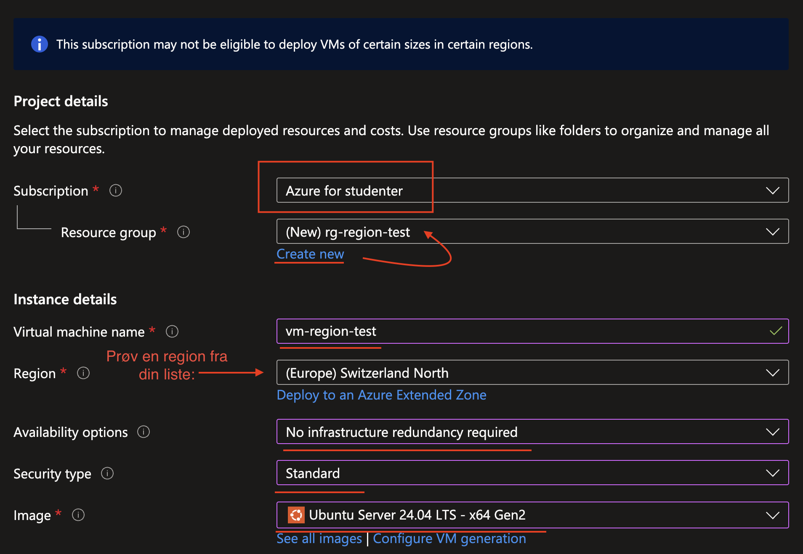
5. Velg deretter **"See all sizes"** og velg B-Series og B1ms (liten og fin testmaskin)
   1. 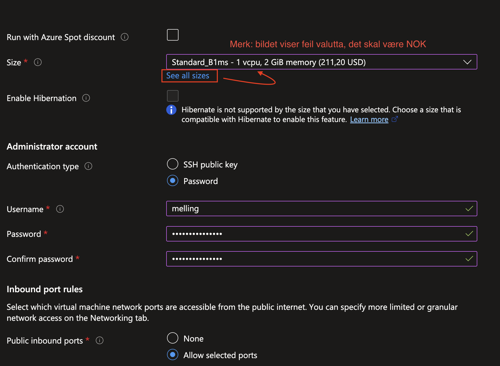
6. Velg deretter **"Review + create"** - Hvis du får feilmelding, gå tilbake til Basic og prøv en av de andre regionene til du får godkjent valideringen.
   1. 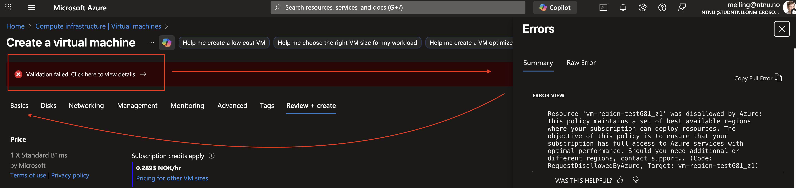
   2. 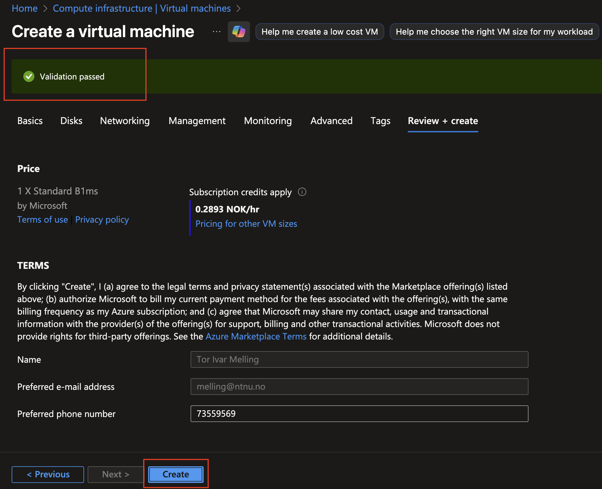
7. ‼️‼️ **Husk å Resource Group med VM-en etter at den erferdig opprettet, dette var kun en test for å finne korrekt region** ‼️‼️
   1. 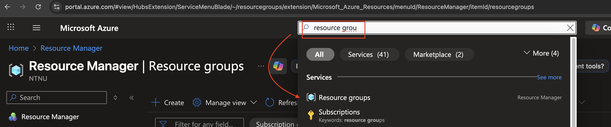
   2. 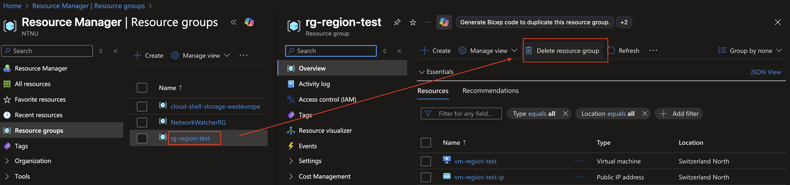
   3. 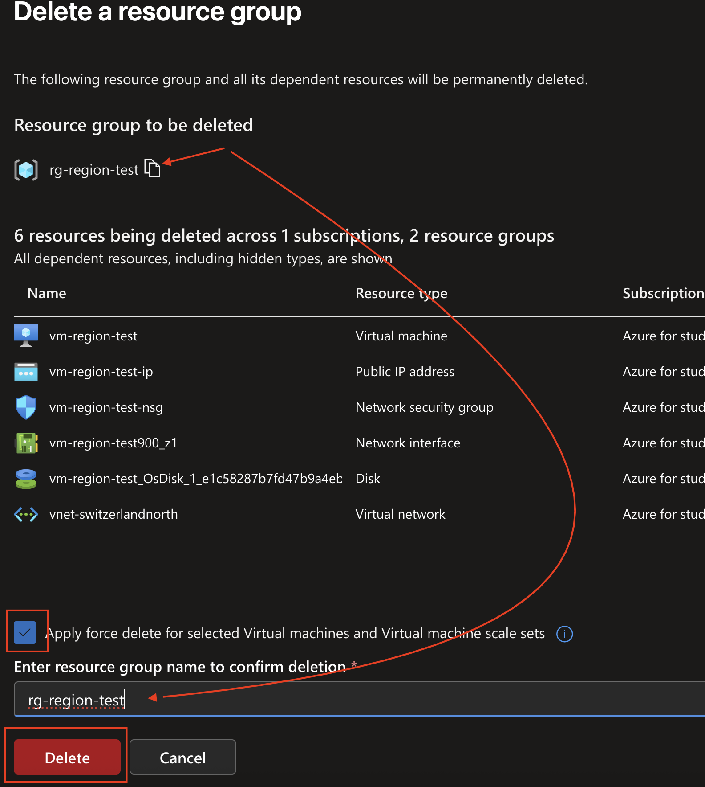
8. Når den er slettet, vil en se en bekreftelse på dette oppe i toppen under bjellen:
   1. 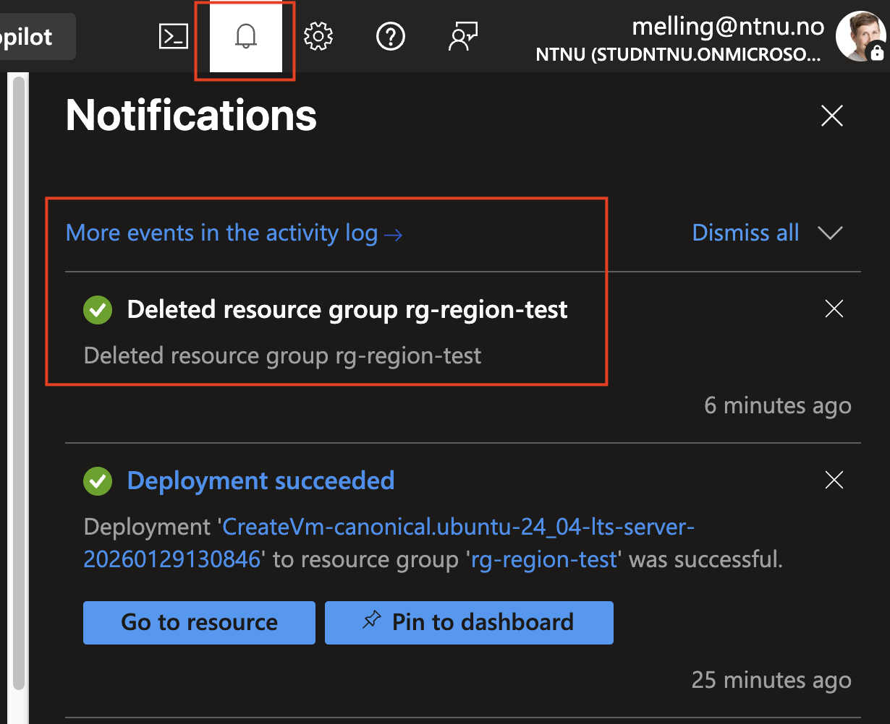

**Eksempel på typiske tillatte regioner:**
- North Europe (Dublin, Irland)
- West Europe (Amsterdam, Nederland)
- UK South (London, Storbritannia)
- Norway East (Oslo, Norge)
- Sweden Central (Gävle, Sverige)

---

## Steg 2: Forstå hvorfor ikke alle regioner fungerer for VM-er

Selv om en region er tillatt i policyen, betyr ikke det at den støtter alle ressurstyper. Azure-regioner har forskjellige kapasiteter:

### Årsaker til at VM-er ikke kan opprettes:

1. **Begrenset infrastruktur**: Noen regioner har ikke full VM-infrastruktur
2. **Kvote-begrensninger**: Azure for Students har begrensede kvoter
3. **VM-størrelse utilgjengelig**: Den spesifikke VM-størrelsen du velger finnes kanskje ikke i regionen
4. **Tilgjengelighet**: Midlertidig eller permanent mangel på kapasitet

---

1. **Observer resultatet**
   - ✅ **Fungerer**: Du kommer videre uten feilmeldinger
   - ❌ **Fungerer ikke**: Du får feilmelding om at regionen ikke støttes eller at VM-størrelsen ikke er tilgjengelig

### Hva du skal se etter i feilmeldinger:

- *"The requested VM size is not available in this region"*
- *"Quota exceeded"*
- *"Location not supported for this subscription"*

---

## Steg 5: Anbefalte VM-størrelser for testing

Når du tester regioner, bruk disse VM-størrelsene (de er mest sannsynlig tilgjengelige):

1. **B-series (Burstable)**:
   - B1s (1 vCPU, 1 GB RAM) - billigst
   - B1ms (1 vCPU, 2 GB RAM)
   - B2s (2 vCPU, 4 GB RAM)
   - B2ms (2 vCPU, 8 GB RAM)

**Tips**: Start alltid med B1s eller B2s for testing!

---

## Steg 6: Fullstendig sjekkliste for VM-oppretting

- [ ] Identifiser dine 5 tillatte regioner via Policy
- [ ] Test VM-oppretting i hver region med B1ms/B2s størrelse
- [ ] For din egen del: Dokumenter hvilke regioner som fungerer
- [ ] Opprett alle fremtidige ressurser i samme region

---

## Vanlige feilmeldinger og løsninger

### Feilmelding: "The requested VM size is not available"
**Løsning**: 
- Prøv en mindre VM-størrelse (f.eks. B1s)
- Prøv en annen region
- Velg en annen VM-serie (B-series i stedet for D-series)

### Feilmelding: "Quota exceeded"
**Løsning**:
- Azure for Students har begrenset kvote (typisk 4 vCPU totalt)
- Slett eksisterende VM-er først
- Velg mindre VM-størrelse

### Feilmelding: "Location not supported"
**Løsning**:
- Denne regionen støtter ikke VM-er i din subscription
- Velg en annen region fra listen over tillatte regioner

---

## Ekstra ressurser

- [Azure Regions oversikt](https://azure.microsoft.com/en-us/explore/global-infrastructure/geographies/)
- [Azure for Students dokumentasjon](https://docs.microsoft.com/en-us/azure/education-hub/)
- [Azure VM-størrelser](https://docs.microsoft.com/en-us/azure/virtual-machines/sizes)
