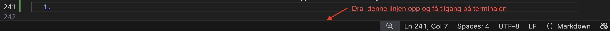
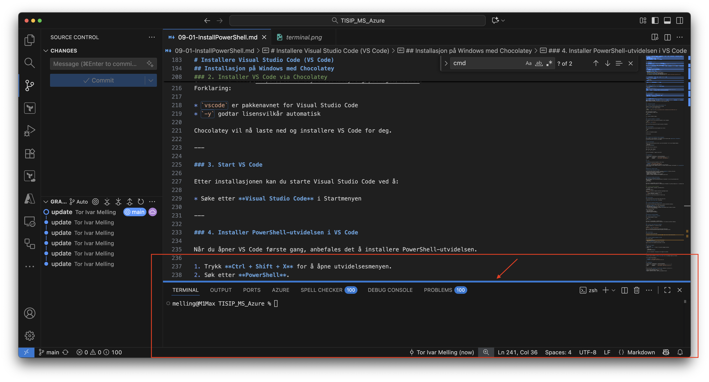
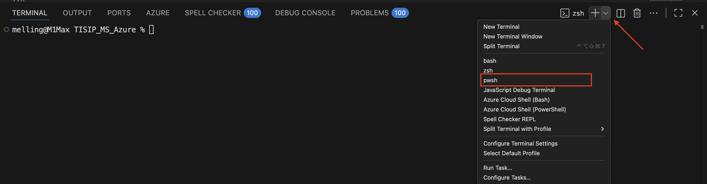
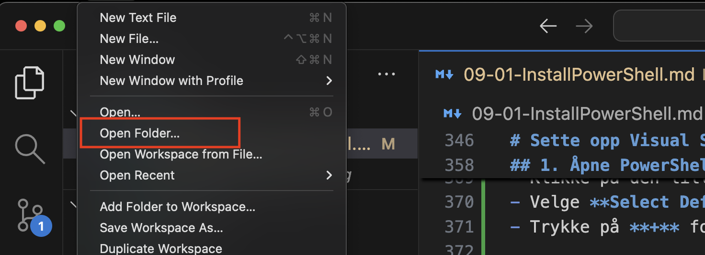
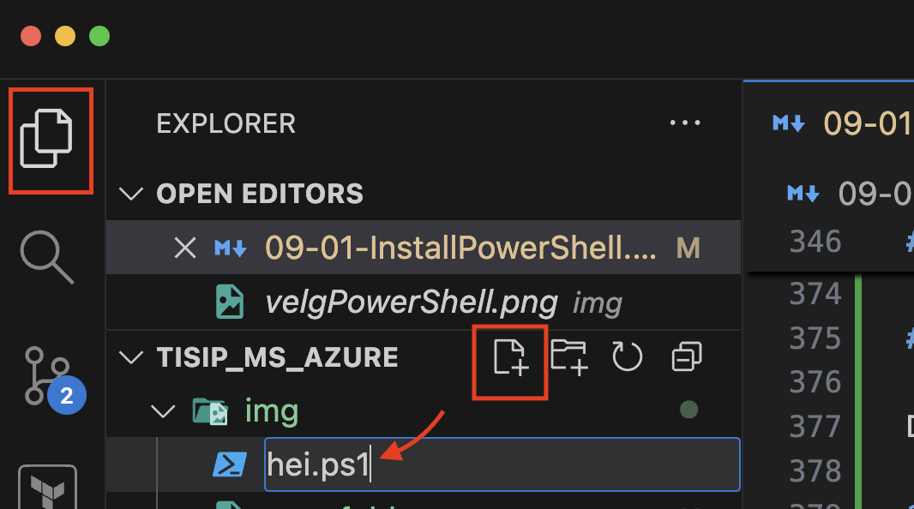
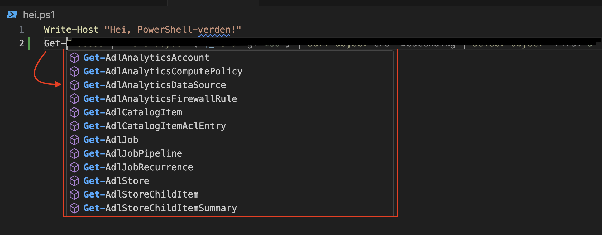

# 💻 Introduksjon: Installere PowerShell 7

PowerShell 7 er den nyeste versjonen av PowerShell, og fungerer på **Windows**, **macOS** og **Linux**.  
Denne veiviseren hjelper deg å installere PowerShell 7 på **Windows** og **Mac**, ved hjelp av **pakkehåndteringsverktøyene** Chocolatey og Homebrew.

---

## 🧭 Før du starter

### Hva er PowerShell?
PowerShell er et kommandolinjeverktøy og skriptspråk som gjør det mulig å automatisere og administrere systemer mer effektivt.  
Du kan bruke PowerShell til å utføre oppgaver som:
- Administrere filer og mapper
- Automatisere oppgaver i Windows eller Azure
- Hente informasjon om systemer
- Utføre konfigurasjon på tvers av mange maskiner

---

## 🪟 Installasjon på Windows

### 1. Kontroller at du har **Administrator-rettigheter**
Du må kjøre kommandolinjen som administrator for å installere programmer via **Chocolatey**.

### 2. Installer **Chocolatey** (hvis du ikke allerede har det)
Chocolatey er en pakkehåndterer for Windows – som gjør det enkelt å installere programmer direkte fra kommandolinjen.

**Slik installerer du Chocolatey:**

1. Åpne **PowerShell som Administrator**  
   - Søk etter *PowerShell* i startmenyen  
   - Høyreklikk og velg **Kjør som administrator**

2. Kjør følgende kommando (kopier og lim inn):
```powershell
   Set-ExecutionPolicy Bypass -Scope Process -Force; `
   [System.Net.ServicePointManager]::SecurityProtocol = `
   [System.Net.ServicePointManager]::SecurityProtocol -bor 3072; `
   iex ((New-Object System.Net.WebClient).DownloadString('https://community.chocolatey.org/install.ps1'))
```


3. Når installasjonen er ferdig, lukk og åpne PowerShell på nytt.

4. Sjekk at Chocolatey fungerer:

   ```powershell
   choco --version
   ```

5. Hvis du ser et versjonsnummer, er alt klart!

---

### 3. Installer **PowerShell 7** via Chocolatey

Nå kan du installere PowerShell 7 med én enkel kommando:

```powershell
choco install powershell-core -y
```
[Choco - PowerShell Core](https://community.chocolatey.org/packages/powershell-core/7.5.4)
Flagget `-y` betyr at du automatisk godtar installasjonsbekreftelsen.

---

### 4. Start PowerShell 7

Etter installasjonen kan du starte PowerShell 7 ved å:

* Søke etter **PowerShell 7** i Startmenyen, eller
* Skrive `pwsh` i kommandolinjen.

---

### 5. (Valgfritt) Gjør PowerShell 7 til standard

Hvis du ønsker at PowerShell 7 skal åpnes som standard når du skriver `powershell` i terminalen, kan du oppdatere snarveier eller legge `pwsh.exe` inn i PATH.
Dette er valgfritt, men kan være nyttig hvis du bruker PowerShell ofte.

---

## 🍎 Installasjon på macOS

### 1. Installer **Homebrew** (hvis du ikke allerede har det)

Homebrew er den mest brukte pakkehåndtereren for macOS.

Åpne **Terminal** og kjør følgende kommando:

```bash
/bin/bash -c "$(curl -fsSL https://raw.githubusercontent.com/Homebrew/install/HEAD/install.sh)"
```

Følg instruksjonene på skjermen.
Når installasjonen er ferdig, skriv:

```bash
brew --version
```

for å sjekke at Homebrew fungerer.

---

### 2. Installer PowerShell 7 via Homebrew

Når Homebrew er klart, kan du installere PowerShell 7 med én kommando:

```bash
brew install --cask powershell
```

Dette laster ned og installerer den nyeste versjonen av PowerShell.

---

### 3. Start PowerShell

Etter installasjonen kan du starte PowerShell ved å skrive:

```bash
pwsh
```

Du skal nå se PowerShell-prompten:

```
PS /Users/navn>
```

---

### 4. (Valgfritt) Gjør PowerShell lettere tilgjengelig

Hvis du ønsker å starte PowerShell 7 fra Launchpad, kan du finne den under **Applications → PowerShell**.
Du kan også feste den til Dock for rask tilgang.

---

## ✅ Test installasjonen

Uansett hvilket operativsystem du bruker, kan du teste PowerShell 7 ved å skrive følgende kommando:

```powershell
$PSVersionTable.PSVersion
```

Dette skal vise noe som ligner på:

```
Major  Minor  Build  Revision
-----  -----  -----  --------
7      4      0      0
```

Da vet du at PowerShell 7 fungerer som det skal!

---

## 🧩 Oppsummering

| Operativsystem | Pakkehåndterer | Installasjonskommando            |
| -------------- | -------------- | -------------------------------- |
| Windows        | Chocolatey     | `choco install powershell -y`    |
| macOS          | Homebrew       | `brew install --cask powershell` |

---

## 💡 Tips

* Du kan alltid avinstallere PowerShell 7 ved å skrive:

  * **Windows:** `choco uninstall powershell -y`
  * **macOS:** `brew uninstall --cask powershell`
* Bruk `pwsh` for å starte PowerShell 7 på tvers av alle plattformer.
* Husk at eldre versjoner (Windows PowerShell 5.1) fortsatt finnes på Windows, men PowerShell 7 er **kryssplattform** og anbefales for all ny bruk.

---

### Neste steg - Installer VS Code

# Installere Visual Studio Code (VS Code)

Visual Studio Code (VS Code) er en gratis og kraftig **kodeeditor** utviklet av Microsoft.  
Den passer perfekt sammen med PowerShell, fordi den gir:
- Fargekoding og autoutfylling av kommandoer  
- Terminal integrert i editoren  
- Mulighet for å kjøre PowerShell direkte i editoren  
- Støtte for utvidelser (extensions) for PowerShell og andre språk  

---

## Installasjon på Windows med Chocolatey

### 1. Sørg for at Chocolatey er installert
Hvis du allerede har fulgt installasjonsveiviseren for PowerShell 7, har du trolig Chocolatey klart.  
Sjekk ved å kjøre:
```powershell
choco --version
````

Hvis du får et versjonsnummer, kan du gå videre.
Hvis ikke, gå tilbake til veiviseren for **installasjon av PowerShell 7** og følg trinnene der for å installere Chocolatey først.

---

### 2. Installer VS Code via Chocolatey

Kjør følgende kommando i PowerShell (som Administrator):

```powershell
choco install vscode -y
```
[Choco - VS Code](https://community.chocolatey.org/packages/vscode)
Forklaring:

* `vscode` er pakkenavnet for Visual Studio Code
* `-y` godtar lisensvilkår automatisk

Chocolatey vil nå laste ned og installere VS Code for deg.

---

### 3. Start VS Code

Etter installasjonen kan du starte Visual Studio Code ved å:

* Søke etter **Visual Studio Code** i Startmenyen

1. Kontroller at du får PowerShell i Terminalen. Dra terminalen opp fra bunnen av kjermen:
   1. 
   2. 
   3. 

---

### 4. Installer PowerShell-utvidelsen i VS Code

Når du åpner VS Code første gang, anbefales det å installere PowerShell-utvidelsen.

1. Trykk **Ctrl + Shift + X** for å åpne utvidelsesmenyen.
2. Søk etter **PowerShell**.
3. Velg *PowerShell* fra Microsoft og trykk **Installer**.


Denne utvidelsen gir deg:

* Syntax highlighting
* IntelliSense (autofullføring)
* Integrert terminal for PowerShell

---

## Installasjon på macOS med Homebrew

### 1. Kontroller at Homebrew er installert

Skriv følgende kommando i Terminal:

```bash
brew --version
```

Hvis du ser et versjonsnummer, er Homebrew klart.
Hvis ikke, se installasjonsveiviseren for PowerShell 7 for hvordan du installerer Homebrew.

---

### 2. Installer Visual Studio Code via Homebrew

Bruk denne kommandoen for å installere VS Code:

```bash
brew install --cask visual-studio-code
```
[Brew - VS Code](https://formulae.brew.sh/cask/visual-studio-code)
Dette laster ned og installerer den nyeste versjonen av VS Code på din Mac.

---

### 3. Start VS Code

Du kan åpne VS Code på flere måter:

* Søk etter **Visual Studio Code** i Spotlight (Cmd + Space → skriv "Visual Studio Code")

---

### 4. Installer PowerShell-utvidelsen i VS Code

Når VS Code er åpnet:

1. Trykk **Cmd + Shift + X** for å åpne utvidelsesmenyen.
2. Søk etter **PowerShell**.
3. Trykk **Installer** på utvidelsen laget av Microsoft.

Dette gir deg et fullt PowerShell-miljø direkte i VS Code!

---

## ✅ Test at alt fungerer

1. Åpne VS Code
2. Trykk **Ctrl + Shit + `** (Mac) for å åpne den innebygde terminalen, eller dra linjen opp fra bunnen
   1. 
   2. 
   3. 
3. Skriv:

   ```powershell
   $PSVersionTable.PSVersion
   ```

   Hvis du ser PowerShell 7-versjonen din – da fungerer alt perfekt!

---

## 💡 Tips og anbefalinger

* Installer gjerne utvidelsen **"Material Icon Theme"** for å få tydeligere mapper og filikoner.


* For å holde VS Code oppdatert:

  * **Windows:** `choco upgrade vscode -y`
  * **macOS:** `brew upgrade --cask visual-studio-code`

---

## 📦 Oppsummering

| Operativsystem | Pakkehåndterer | Installasjonskommando                    |
| -------------- | -------------- | ---------------------------------------- |
| Windows        | Chocolatey     | `choco install vscode -y`                |
| macOS          | Homebrew       | `brew install --cask visual-studio-code` |

---

Nå som du har både **PowerShell 7** og **VS Code** installert, er du klar til å:

* Skrive og kjøre PowerShell-skript (`.ps1`-filer)
* Utforske terminalen direkte i VS Code
* Begynne å jobbe med variabler, løkker og systemadministrasjon!

# Sette opp Visual Studio Code for PowerShell-scripting

Nå som du har installert **PowerShell 7** og **Visual Studio Code (VS Code)**, er du klar til å begynne å **skrive, kjøre og teste PowerShell-skript** på en trygg og effektiv måte.

I denne veiviseren lærer du hvordan du:
1. Setter opp VS Code til å jobbe med PowerShell  
2. Lager ditt første PowerShell-skript  
3. Kjører og feilsøker skriptet  
4. Aktiverer skriptkjøring (Execution Policy)

---

## 1. Åpne PowerShell-miljøet i VS Code

1. Start **VS Code**  
2. Åpne den innebygde terminalen
3. Du skal nå se noe som dette nederst i vinduet:
```

PS C:\Users\dittnavn>

```
Hvis terminalen viser “bash” eller “cmd”, kan du bytte til PowerShell ved å:
- Klikke på den lille pilen ved siden av terminalnavnet  
- Velge **Select Default Profile → PowerShell**  
- Trykke på **+** for å åpne en ny PowerShell-terminal

---

## 📁 2. Opprett en prosjektmappe

Det er lurt å samle PowerShell-filer i en egen mappe.

1. Opprett en mappe på ønsket sted som heter:
```
PowerShellProsjekt
````

2. Åpne mappen i VS Code (Open Folder)


---

## 📝 3. Lag ditt første PowerShell-skript

1. I VS Code, klikk på **New File** (øverst til venstre)

2. Gi filen navnet:

   ```
   hei.ps1
   ```

   (`.ps1` forteller systemet at dette er et PowerShell-skript)

3. Skriv inn følgende kode i filen:

   ```powershell
   # Dette er ditt første PowerShell-skript!
   Write-Host "Hei, PowerShell-verden!"
   ```

4. Lagre filen med **Ctrl + S** (Windows) eller **Cmd + S** (Mac)

---

## ▶️ 4. Kjør PowerShell-skriptet i VS Code

Du kan kjøre skriptet direkte i terminalen nederst i VS Code.

Skriv (Windows):

```powershell
.\hei.ps1
```

Du skal se:

```
Hei, PowerShell-verden!
```

🎉 Gratulerer – du har nettopp kjørt ditt første PowerShell-skript!

---

## 🚫 5. Feilmelding? Aktiver skriptkjøring

Hvis du får en melding som ligner på:

```
File C:\Users\dittnavn\Desktop\PowerShellProsjekt\hei.ps1 cannot be loaded because running scripts is disabled on this system.
```

... betyr det at **Execution Policy** forhindrer kjøring av skript. Dette er en sikkerhetsfunksjon.

For å aktivere kjøring av lokale skript:

1. Åpne VS Code-terminalen som **administrator** (kun Windows):

   * Søk etter “VS Code” i Startmenyen
   * Høyreklikk → “Kjør som administrator”

2. Kjør denne kommandoen:

   ```powershell
   Set-ExecutionPolicy RemoteSigned -Scope CurrentUser
   ```

3. Trykk **Y** og Enter for å bekrefte.

Dette tillater kjøring av skript du selv har laget, men beskytter deg fortsatt mot ukjente eksterne skript.

---

## 🔍 6. Test Execution Policy

Skriv:

```powershell
Get-ExecutionPolicy
```

Hvis du ser:

```
RemoteSigned
```

... da er alt riktig konfigurert!

---

## 🧠 7. Bonus: Bruk av PowerShell-integrasjonen i VS Code

Når du har installert **PowerShell-utvidelsen**, får du flere nyttige funksjoner:

* **Fargekoding** av PowerShell-syntaks
* **Autoutfylling** av kommandoer (IntelliSense)
* **Dokumentasjon** vises når du holder musepekeren over kommandoer
* **Feilmeldinger** vises direkte i editoren

Prøv å skrive:

```powershell
Get-
```

… og se hvordan VS Code foreslår kommandoer du kan bruke.

---

## 8. Nyttige hurtigtaster i VS Code for PowerShell

| Funksjon        | Windows            | macOS             |
| --------------- | ------------------ | ----------------- |
| Kjør valgt kode | `F8`               | `F8`              |
| Åpne terminal   | `Ctrl + ``         | `Cmd + ``         |
| Lagre fil       | `Ctrl + S`         | `Cmd + S`         |
| Kommenter linje | `Ctrl + /`         | `Cmd + /`         |
| Åpne utvidelser | `Ctrl + Shift + X` | `Cmd + Shift + X` |

---

## ✅ Oppsummering

| Trinn | Hva du gjorde              | Kommando / handling                                   |
| ----- | -------------------------- | ----------------------------------------------------- |
| 1     | Åpnet PowerShell i VS Code | `Ctrl + ``                                            |
| 2     | Laget nytt skript          | `hei.ps1`                                             |
| 3     | Kjørte skriptet            | `.\hei.ps1`                                           |
| 4     | Aktiverte skriptkjøring    | `Set-ExecutionPolicy RemoteSigned -Scope CurrentUser` |

---
